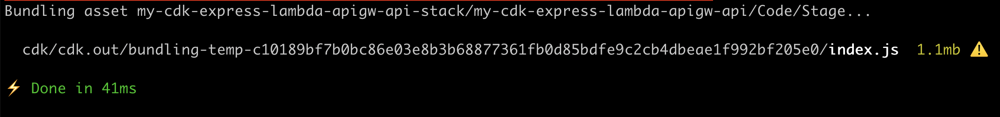
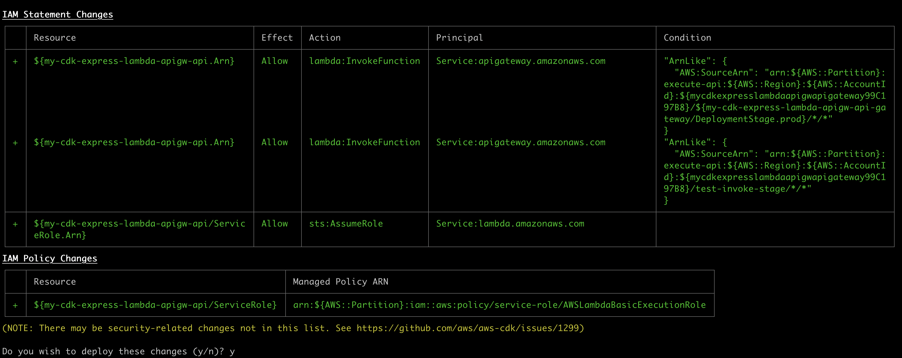
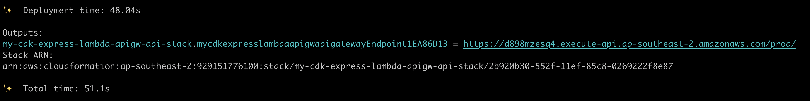
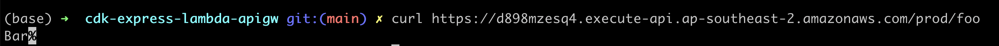

# CDK Template - Express API, using TypeScript, that runs entirely on AWS Lambda.

> This our go-to API pattern at Vyro. It's practically free to run, scales like there is no tomorrow, and has a deploy time of around ~30s. Distributed freely under a [CC0 license](./LICENSE.txt).

## Pre-reqs

- Node.js, recommend version 20 or above. Lower versions are probably fine.
- PNPM, or NPM, or Yarn. We've used PNPM but adjust accordingly.
- AWS Account with local CLI access

## Local development

The API runs locally like so:

```
pnpm i

cd api

pnpm run dev
```

## Deploying

### Pre-reqs

Make sure you have an AWS account and have local CLI access to deploy to it. Google can walk you through this. You should be able to do something like `aws s3 ls` and see a list of S3 buckets in your account.

```
pnpm i

pnpm run deploy
```

The `deploy` command will trigger the `cdk` folder to deploy the service to AWS. It will also build the API using `esbuild`, which is super fast. Checkout the logs.



You'll likely be asked to consent to IAM changes in your AWS account. Tick Y for Yes.



When the deployment is finished (don't go anywhere, it's pretty fast) you'll see an endpoint in the outputs.



Copy that endpoint and hit your API, like so:

```
curl {{endpoint from above}}foo
```



That's it. Enjoy.

## Destroying

```
pnpm run destroy
```
